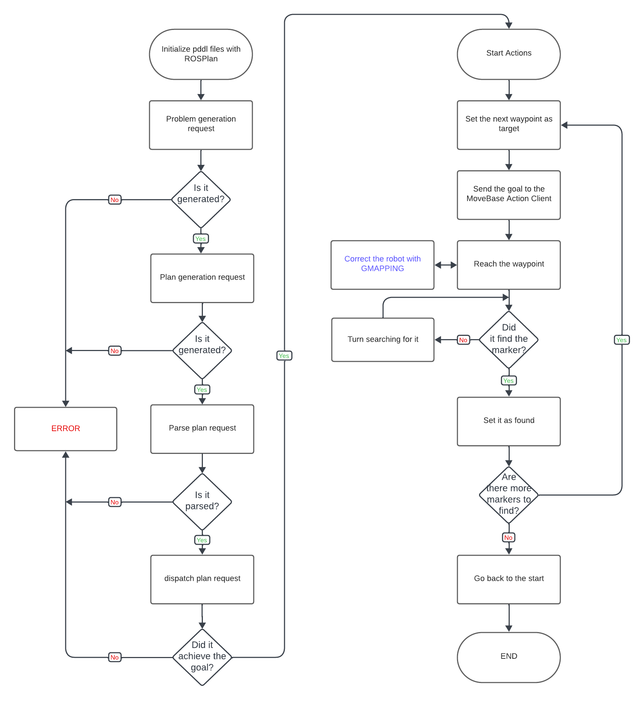

Experimental Robotics Laboratory
======================================

Project Description
-------------------------

The aim of this project is to develop a ROS package that uses pddl and ROSPlan to guide a mobile robot endowed with a camera to find all markers in the environment and then go back to the initial position while autonomously avoid any obstacle on the path.

The marker will be set everytime in known positions:
- marker 11 is visible from the position x = 6.0, y = 2.0
- marker 12 is visible from the position x = 7.0, y = -5.0
- marker 13 is visible from the position x = -3.0, y = -8.0
- marker 15 is visible from the position x = -7.0, y = -1.5
- the initial position is situated at x = 0.0, y = 1.0

Team Members
-------------

|    |Name |Surname |ID |
|----|---|---|---|
| 1 | Michele | Moriconi | S4861803 |
| 2 | Giovanni | Rocca | S4802954 |
| 3 | Matteo | Cappellini | S4822622 |
| 4 | Manuel | Delucchi | S4803977 |
| 5 | Andrea | Bolla | S4482930 |


Create and setup a Catkin Workspace
--------------------------------

A catkin (ROS) workspace is a directory in which you can create or modify existing catkin packages. We will label our catkin workspace `catkin_ws`. To create the catkin workspace, type the following commands in the Terminal:

```bash
mkdir catkin_ws
cd catkin_ws
mkdir src
catkin_make
```

This will allow us to create a new folder in the home directory called `catkin_ws` by using the `mkdir` command. Then we create a source `src` folder inside the catkin workspace folder. Once done, make sure to use the command `catkin_make` inside the `catkin_ws` folder in order to init the catkin workspace. If you view your current directory contents, you should now have the `devel` and `build` folders. Inside the `devel` folder there are now several `setup.*sh` files. 

Then, we will need to source the `setup.bash` file to overlay this workspace on top of our ROS environment. In order to do this, it is necessary to go back in your home directory with the `cd` command and then type:

```bash
source ~/catkin_ws/devel/setup.bash
```

Remember to add this source command to your `.bashrc` file under the source line of the global ROS installation. This is important so as to use your code with ROS functionalities. In order to access the `.bashrc` file type the following command:

```bash
gedit ~/.bashrc
```

How to run the simulation
-------------------------

In order to be able to run this simulation it will be needed to install the needed dependancies for the planning and for the navigation beforehand.

First thing first, move inside the `src` folder of your ros workspace and download the dependancies on `aruco_ros` and on `rosbot_ros`, by running these commands:

```bash
git clone https://github.com/CarmineD8/aruco_ros.git
git clone https://github.com/husarion/rosbot_ros.git -b noetic 
```
`Note` : be careful to add "-y 1.0" inside args at line 9 of the launch file `rosbot_ros/src/rosbot_bringup/launch/rosbot_gazebo.launch`

Then, in order to be able to use ROSPlan, run on terminal:

```bash
sudo apt install flex bison freeglut3-dev libbdd-dev python3-catkin-tools ros-noetic-tf2-bullet
git clone https://github.com/KCL-Planning/ROSPlan
```
`Note` : you will need to modify the `CMakeList.txt` file inside the package `rosplan_dependencies` by adding at line 92 the string "-Wno-error=deprecated-copy"

Now, in order to install the packages relative to the navigation, run inside the `src` folder:

```bash
git clone https://github.com/ros-planning/navigation.git
```

At this point we can install `gmapping` by running the following lines of code:

```bash
sudo apt-get install ros-<ros_distro>-openslam-gmapping
git clone -b noetic https://github.com/CarmineD8/SLAM_packages.git
```

Now run `catkin_make` inside the `catkin_ws` folder in order to build the workspace.

`Note` : there may be some problems while running this command, in order to avoid it, remove the package `amcl` from the navigation packages and try again.

Finally, download our project in the `src` folder with:

```bash
https://github.com/MickyMori/Lab_assignment_2.git
```

Build with `catkin_make --only-pkg-with-deps lab_assignment_2` and run the whole project by running the launch file:

```bash
roslaunch lab_assignment_2 assignment.launch
```

Flowchart
-----------------------

### Logic Node (logic_node.cpp)

Works with `ROSPlan` in order to:
* Generate the problem.
* Generate the plan.
* Parse the plan.
* Dispatch the plan in order to reach the goal of the task.

### Camera Node (CV_node.cpp)

* Subscribes to target and camera feed messages.
* Detects Aruco markers by processing them.
* Publishes marker information to control robot movement.

### GoToTarget Node (go_to_waypoint_action.cpp)

Receives the targeted waypoint from the dispatcher by implementing the durative action `goto_waypoint` defined in the domain and sends the goal to the `Action Client`.

### FindMarker Action Server Node (find_marker_action_server.cpp)

Create an `Action Server` that:
* Publishes on the `/rosbot/search_id` topic the ID of the marker it is searching for.
* Rrotates the robot by publishing angular velocity commands on the `/cmd_vel topic` to search for the marker.
* Subscribes to the `/rosbot/marker_found` topic to know wether the marker was found or not.

### FindMarker Action Client Node (find_marker_action_client.cpp)

Create an `Action Client` that:
* Sends a goal indicating the ID of the marker it wants to find.
* Prints on screen if the robot succedeed in finding the goal.
  


Simulation
-----------------------

Here is the simulated behaviour of the robot, provided with a window that shows what the robot's camera is capturing.

https://github.com/MickyMori/Lab_assignment_2/assets/104144305/3842905a-2b04-4348-b604-f1e51f4b2101


Possible Improvements
-----------------------

